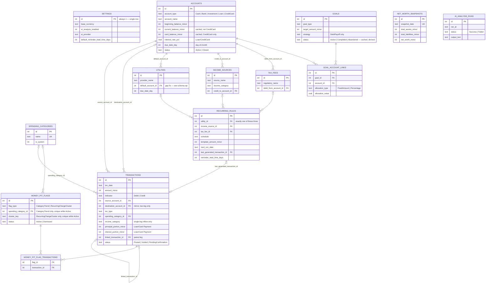

# ClearPath AI — Entity-Relationship Diagram

Derived from `ClearPath-AI-Spec-Baseline.md` (v9, closed) and implemented in `schema/schema.sql` (SQLite). Five entities here — `UTILITIES`, `INCOME_SOURCES`, `TAX_FEES`, `NET_WORTH_SNAPSHOTS`, `MONEY_PIT_FLAGS` — were never formalized as tables in the prose spec; they're formalized here for the first time. See the header comment in `schema.sql` for the full list of gaps this translation surfaced.

## Diagram

## Reading this diagram

- **`ACCOUNTS` is the hub.** Every module in the spec (Cash, Bank, Investment, Loans, Credit Cards) is one `account_type` row here (2.1) — that's the whole point of the "unified Account model."
- **`TRANSACTIONS` referencing itself** (`linked_transaction_id`) is the two-leg structure from §2.2: a transfer, buy/sell, loan/card payment, or disbursement is two independent rows pointing at each other, not one row with two account columns.
- **`SETTINGS`, `NET_WORTH_SNAPSHOTS`, `AI_ANALYSIS_RUNS`** have no foreign keys in or out — they're singleton/log tables, not part of the relational graph.
- **Dotted vs. solid connector ends**: `|o` = optional (zero-or-one), `||` = mandatory (exactly-one), `o{` = zero-or-many, `{` alone = one-or-many. `ACCOUNTS |o--o{ TRANSACTIONS` (destination) is optional both ways because most transactions are single-leg.

## Resolved since first draft

Three questions came out of building this diagram (not the prose review); all three are now resolved in `schema.sql`:

1. **Onboarding order.** `utilities.default_account_id`, `income_sources.credit_to_account_id`, `tax_fees.debit_from_account_id`, and `goal_account_links.account_id` are all `NOT NULL`, on purpose — at least one Account must exist before anything else can be created, consistent with Account already being the foundation everything else in the spec builds on (2.1). Setup flow: Settings → at least one Account → everything else.
2. **Day-of-month clamping.** `due_date_day` / `cut_off_date_day` are a recurring day-of-month (1–31), and when that day doesn't exist in the target month (day 31 in a 30-day month, day 29–31 in February), it clamps to that month's last day — the standard billing-cycle convention. Same rule applies when `recurring_rules.next_run_date` advances across a Monthly/Bi-Monthly boundary. Reference query in `schema.sql`.
3. **Money-pit flag dedup.** At most one `Active` flag per category (`CategoryTrend`) or recurring-charge pattern (`RecurringChargeCluster`, keyed by a new `cluster_key` column), enforced by two partial unique indexes. Re-detecting an already-`Active` pattern updates that row rather than duplicating it; a pattern the user dismissed gets a *new* row if it resurfaces later — dismissal is a user-owned terminal state that re-detection never silently overturns, mirroring how Goal Status (2.8) never overrides a user's `Abandoned` choice.
